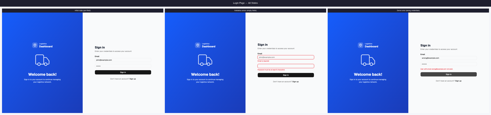
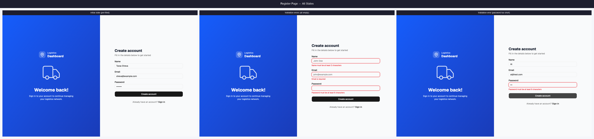
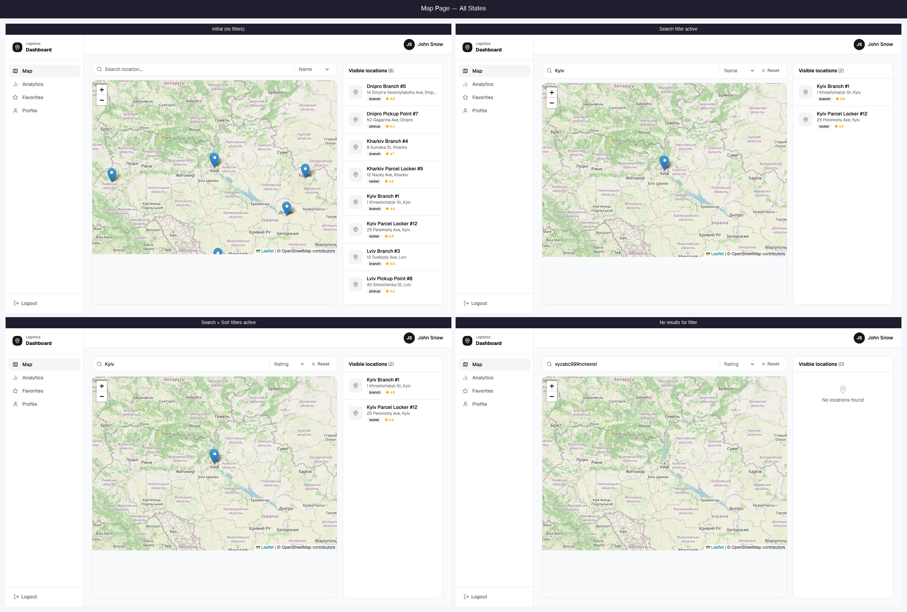
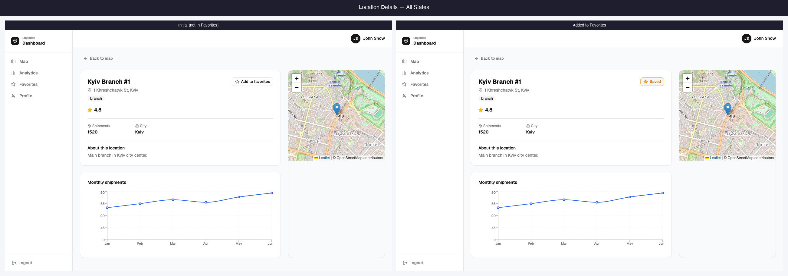
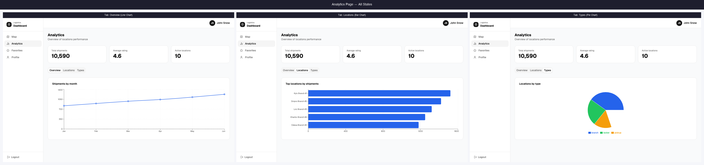
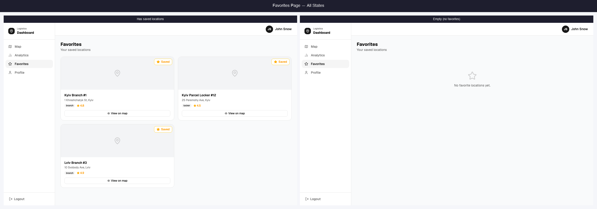
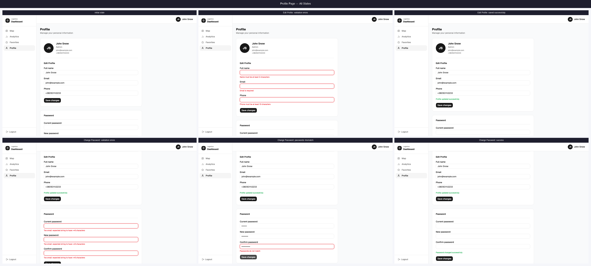
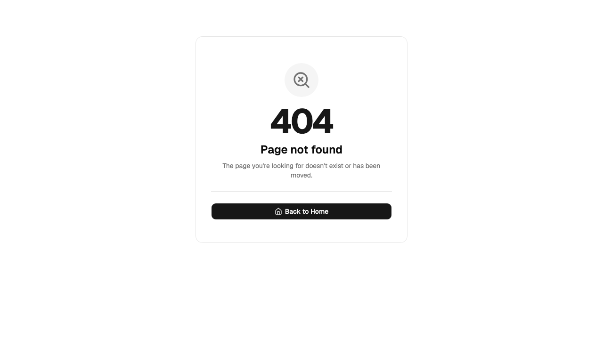

# 💌 Logistics Dashboard

A logistics location management dashboard built with React 19. Browse locations on an interactive map, track shipment analytics, manage favourites, and handle user authentication — all in one clean interface.

---

## Pages

| | |
|---|---|
|  |  |
| **Login** — form validation, server error handling | **Register** — real-time field validation |
|  |  |
| **Map** — interactive map with search & filters | **Location Details** — info panel with favourite toggle |
|  |  |
| **Analytics** — KPI cards and multiple chart types | **Favourites** — saved locations list |
|  |  |
| **Profile** — edit info and change password | **404** — not found page |

---

## Tech Stack

| Category | Library |
|---|---|
| UI Framework | React 19 + React Compiler |
| Routing | React Router v7 |
| Server State | TanStack Query v5 |
| Global State | Zustand v5 + persist middleware |
| HTTP | Axios |
| Forms | React Hook Form + Zod |
| Map | Leaflet + React Leaflet |
| Charts | Recharts |
| Styling | Tailwind CSS v4 + shadcn/ui |
| Build | Vite 8 |

---

## Features

- **Authentication** — login and register with form validation and server error display
- **Protected routes** — dashboard is only accessible to authenticated users
- **Interactive map** — view all locations as markers, filter by type, search by name
- **Location details** — full info panel with shipment count, rating, and favourite toggle
- **Analytics dashboard** — KPI cards, shipments line chart, location types pie chart, top locations bar chart
- **Favourites** — add/remove locations, persistent across sessions via Zustand persist
- **Profile** — edit display name and email, change password with confirmation
- **Error boundaries** — route-level error handling

---

## Getting Started

### Prerequisites

- Node.js 18+
- pnpm

### Installation

```bash
# Clone the repository
git clone <repository-url>
cd logistics-dashboard

# Install dependencies
pnpm install

# Set up environment variables
cp .env.example .env
```

### Environment Variables

```
VITE_API_URL=https://your-api-url.com
```

### Development

```bash
pnpm dev
```

### Production Build

```bash
pnpm build
pnpm preview
```

---

## Project Structure

```
src/
├── api/
│   ├── createService.js        ← generic CRUD service factory
│   ├── authApi.js
│   ├── locationsApi.js
│   └── usersApi.js
├── components/
│   ├── analytics/              ← KPI cards and chart components
│   ├── auth/                   ← LoginForm, RegisterForm, LogoutButton
│   ├── dashboard/              ← Header, Sidebar, UserMenu
│   ├── favorites/              ← FavouriteButton, FavouriteCard, FavouritesList
│   ├── locations/              ← LocationCard, Filters, Search, Sort
│   ├── map/                    ← LocationMap, MapBoundsHandler
│   ├── profile/                ← EditProfileForm, ChangePasswordForm
│   └── ui/                     ← shadcn components
├── hooks/                      ← TanStack Query hooks per feature
├── layouts/
│   ├── AuthLayout.jsx
│   └── DashboardLayout.jsx
├── providers/
│   └── QueryProvider.jsx
├── router/
│   ├── router.jsx
│   ├── ProtectedRoute.jsx      ← redirects to /login if not authenticated
│   └── PublicRoute.jsx         ← redirects to /dashboard if already authenticated
├── routes/                     ← one file per route/page
├── schemas/                    ← Zod validation schemas
└── store/
    ├── authStore.js            ← auth state with persist
    └── favoritesStore.js       ← favourites state with persist
```

---

## Architecture Notes

**Routing** — two layout groups with guard components: `PublicRoute` blocks the auth pages when logged in, `ProtectedRoute` blocks the dashboard when logged out.

**Server state** — all API calls go through TanStack Query hooks in `/hooks`. Query keys are centralised in `queryKeys.js`.

**Global state** — Zustand with `persist` middleware keeps auth and favourites in `localStorage` across page refreshes.

**API layer** — `createService.js` generates a standard CRUD interface for any endpoint, keeping individual API files minimal.
